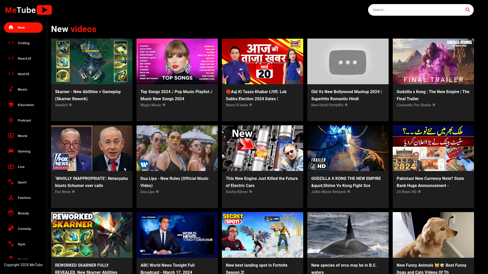

<!-- PROJECT LOGO -->

  

<h3 align="center"><b>MeTube</b></h3>

  

    A clone of YouTube
     
     
    <a href="https://metube1.netlify.app">View Demo</a>
  

 

<!-- ABOUT THE PROJECT -->

## Preview

 

> **Note**
>
> > Application is still under Development

 

## Built With

- 
- 
- 
- 

 

<!-- CONTACT -->

## Developers

